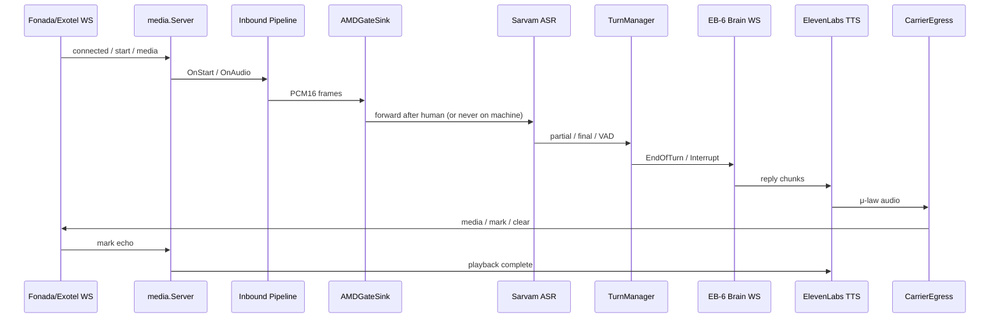

# Call Testing Pipeline — Go Data-Plane

**Module:** `websocket` (Go 1.23)  
**Entry point:** `cmd/server/main.go`  
**Status:** CT-1 through CT-14 complete; all `go test ./...` green.

This document is the canonical context for Cursor (or any developer) working on the Go bidirectional media server that sits between **Fonada/Exotel carrier WebSocket** and **Sarvam ASR → Turn Manager → EB-6 Brain → ElevenLabs TTS → Carrier egress**.

---

## What this service does

Handles one outbound telephony call as a persistent WebSocket session:

1. **Inbound:** Carrier sends μ-law (or L16) audio frames → transcode → denoise → AMD gate → ASR → turn-taking → brain.
2. **Outbound:** Brain reply text → TTS (μ-law) → paced carrier egress → carrier plays to callee; mark/clear for playback sync and barge-in.
3. **Control:** AMD human/machine branching, opener gating, barge-in, observability (timing + Prometheus), dead-air watchdog.

---

## Architecture (full loop)



### Inbound sink chain (inner pipeline)

Outermost wrapper is `brain.BootstrapSink`; inner chain (audio direction) is:

```
BootstrapSink
  └─ TranscodeSink          (CT-2: μ-law/L16 → PCM16, 20 ms frames)
       └─ DenoiseSink       (CT-3: DeepFilterNet worker; NoopAEC stub)
            └─ AMDGateSink   (CT-5/CT-14: buffer window, human/machine)
                 └─ ASRSink  (CT-4: Sarvam streaming → TurnManager)
```

Parallel control paths (not in sink chain):

- **TurnManager** (CT-6/7/11): endpointing, semantic EOU, backchannel, barge-in.
- **brain.Client** (EB-6): `TurnListener` → sends turns; receives chunks/done/error.
- **TTSReplyConsumer** (CT-9): `ReplyConsumer` → TTS → `CarrierEgress`.
- **CallControl** (CT-14): `AMDOutcomeListener` → opener on human, voicemail branch on machine.

---

## Repository layout

```
Websocket/
├── cmd/
│   ├── server/main.go          # Production wiring (all env config)
│   └── replay/main.go          # CLI: replay .ulaw/.wav against running server
├── internal/
│   ├── brain/
│   │   ├── client.go           # EB-6 WebSocket client (TurnListener)
│   │   ├── bootstrap_sink.go   # Session bootstrap: brain/TTS/egress bind
│   │   ├── call_control.go     # CT-14: AMD human opener + voicemail branch
│   │   └── contract.go         # Brain wire message types
│   └── media/
│       ├── server.go           # HTTP + WS server, /healthz, /metrics
│       ├── session.go          # Session manager, outbound writer queue
│       ├── events.go           # Carrier inbound event structs/parser
│       ├── sink.go             # AudioSink interface
│       ├── buffer.go           # TranscodeSink
│       ├── denoise_sink.go     # DenoiseSink + AEC seam
│       ├── amd_gate.go         # AMDGateSink
│       ├── asr_sink.go         # ASRSink
│       ├── turn_manager.go     # Turn-taking + barge-in hooks
│       ├── bargein.go          # CT-11 barge-in orchestrator
│       ├── egress_carrier.go   # CT-10 outbound pacing + mark/clear
│       ├── tts_reply_consumer.go
│       ├── sarvam_asr.go       # Sarvam provider
│       ├── elevenlabs_tts.go   # ElevenLabs provider
│       ├── timing.go           # CT-12 per-turn stage marks
│       ├── metrics.go          # CT-12 Prometheus
│       ├── watchdog.go         # CT-12 dead-air holding line
│       ├── carrier.go          # CT-14 Fonada/Exotel serializer select
│       ├── voicemail.go        # CT-14 VOICEMAIL_ACTION config
│       ├── sim/                # CT-13 carrier simulator + smoke harness
│       └── eval/               # CT-13 WER, AMD eval, latency percentiles
├── workers/
│   ├── denoise/                # DeepFilterNet3 sidecar (CT-3)
│   ├── amd/                    # Whisper-small AMD sidecar (CT-5)
│   └── semantic_turn/          # Semantic EOU sidecar (CT-7)
├── testdata/                   # smoke.ulaw, amd_labels.csv, calls/ layout
├── docs/
│   └── pilot_runbook.md        # CT-14 manual live dry-run steps
└── IMPLEMENTATION.md           # this file
```

---

## Sprint map (commits)

| Sprint | Commit theme | Key deliverable |
|--------|--------------|-----------------|
| CT-1 | Session + WS ingress | `Server`, `SessionManager`, `AudioSink`, Exotel-style events |
| CT-2 | Transcode | `TranscodeSink`: μ-law/L16 → PCM16 @ 8/16 kHz, 20 ms frames |
| CT-3 | Denoise | `DenoiseSink`, DeepFilterNet worker, `NoopAEC` stub |
| CT-4 | ASR | `ASRSink`, Sarvam streaming WS, `TranscriptConsumer` |
| CT-5 | AMD | `AMDGateSink`, Whisper AMD worker, fail-open-to-human |
| CT-6 | Turn-taking | `TurnManager`, per-flow silence, VAD signals, `TurnListener` |
| CT-7 | Semantic EOU | Semantic turn + backchannel classifiers (optional sidecars) |
| EB-6 | Brain client | `brain.Client`, session_start/turn/chunk/done/error |
| CT-9 | TTS | ElevenLabs streaming, `TTSReplyConsumer`, `AudioEgress` seam |
| CT-10 | Egress | `CarrierEgress`, paced μ-law, mark/clear, playback listener |
| CT-11 | Barge-in | Fast VAD pause → classify → resume\|commit; clear + cancel |
| CT-12 | Observability | `TurnTimingHub`, Prometheus `/metrics`, dead-air watchdog |
| CT-13 | E2E harness | `sim.CarrierSimulator`, `cmd/replay`, `eval` package, CI smoke |
| CT-14 | Pilot | Opener gated on AMD-human, voicemail branch, `CARRIER` select |

---

## Stable interfaces (do not break without explicit sprint)

These are intentional extension points; new behavior wraps them, not replaces signatures.

| Interface | Package | Role |
|-----------|---------|------|
| `AudioSink` | media | Inbound lifecycle + PCM/c carrier bytes |
| `TranscriptConsumer` | media | ASR partial/final/VAD → turn manager |
| `TurnListener` | media | Turn events → brain |
| `ReplyConsumer` | media | Brain reply → TTS/logging |
| `AudioEgress` | media | TTS audio → carrier (media/mark/clear) |
| `CarrierSerializer` | media | JSON framing for outbound carrier WS |
| `AMDOutcomeListener` | media | Human/machine callbacks |
| `PlaybackListener` | media | Inbound carrier mark echo → playback complete |
| `ASRProvider` / `TTSProvider` | media | Vendor backends |
| `AMDClassifier` | media | AMD worker client |
| `Denoiser` / `AEC` | media | Audio enhancement seams |

---

## Carrier WebSocket protocol (inbound from Fonada/Exotel)

Parsed by `ParseInboundEvent` in `internal/media/events.go`.

| Event | Purpose |
|-------|---------|
| `connected` | Handshake (logged only) |
| `start` | Creates session: `stream_sid`, `call_sid`, `media_format` |
| `media` | Base64 μ-law (typ. 160 B = 20 ms @ 8 kHz) |
| `mark` | Carrier echo when outbound playback reached a mark |
| `dtmf` | Keypad digit |
| `stop` | End session |

**Outbound** (via `CarrierSerializer`): `media`, `mark`, `clear` (barge-in).

**CT-14:** `CARRIER=fonada` (default) or `exotel` selects `FonadaSerializer` / `ExotelSerializer` (currently same JSON shape; GO-A can diverge later).

---

## Brain WebSocket protocol (EB-6)

Defined in `internal/brain/contract.go`.

**Go → brain:** `session_start`, `turn`, `cancel`, `session_end`  
**Brain → Go:** `chunk`, `flow_class`, `done`, `error`

`brain.Client` implements `media.TurnListener`. `BootstrapSink` connects brain per session and sends opener (see CT-14 gating below).

---

## CT-14: AMD-gated opener & voicemail

### Opener gating (`AMD_ENABLED=1`)

- **No opener on session start.** `BootstrapSink` skips `SendOpenerTurn` when AMD enabled.
- **`CarrierEgress.EnableHumanGate()`** pauses outbound audio until human confirmed.
- **`AMDGateSink`** defers downstream `OnStart` (ASR/Sarvam) until AMD decides **human** — no ASR cost on machine.
- **`CallControl.OnHuman`:** `ConfirmHuman()` → `Brain.Connect()` (if needed) → `SendOpenerTurn()`.

When `AMD_ENABLED=0`: legacy behavior — opener on session start, no human gate.

### Voicemail branch (`OnMachine`)

| `VOICEMAIL_ACTION` | Behavior |
|--------------------|----------|
| `hangup` (default) | `SessionCloser.CloseSession()` — no conversation, metrics `amd_machine_total++` |
| `leave_message` | Speak `VOICEMAIL_MESSAGE` via TTS once, hang up after mark echo |

Config: `internal/media/voicemail.go`, handler: `internal/brain/call_control.go`.

---

## Turn-taking & barge-in (summary)

**TurnManager** emits:

- `TurnSpeechStarted`, `TurnEndOfTurn`, `TurnInterrupt`

**Endpointing (CT-6):** Per-flow silence after ASR final + speech_end (`SILENCE_MS_YES_NO`, `SILENCE_MS_DEFAULT`, `SILENCE_MS_SPELLED`).

**Semantic turn (CT-7, optional):** Sidecar predicts end-of-utterance; fail-safe to silence timers.

**Barge-in (CT-11):** Local VAD onsets during agent speech → pause egress → backchannel classify → resume or commit (clear + TTS cancel + brain cancel). Timeout: `BARGEIN_CLASSIFY_TIMEOUT_MS` (default 300).

---

## Observability (CT-12)

### Per-turn timing (`TurnTimingHub`)

Stage marks: `caller_end`, `asr_final`, `engine_sent`, `engine_first_chunk`, `tts_first_audio`, `egress_first_frame`, `playback_complete`.

Derived: `asr_ms`, `endpoint_ms`, `engine_ms`, `tts_ms`, `mouth_to_ear_ms`, `opener_ms`.

One structured JSON log per completed turn. Budget warn if `mouth_to_ear_ms` > `MOUTH_TO_EAR_TARGET_MS` (default 1200).

### Prometheus

`GET /metrics` on same HTTP server as WS. Counters/histograms: stage latency, mouth-to-ear, turns, fallbacks, barge-ins, AMD, reconnects, outbound drops, active sessions.

### Dead-air watchdog

If no egress audio within `FALLBACK_NO_AUDIO_MS` (default 2000) after caller end → speak `HOLDING_LINE` once via TTS.

---

## Testing (CT-13)

| Mode | How | Gated by |
|------|-----|----------|
| **CI smoke** | `internal/media/sim` — fake ASR/brain/TTS + `CarrierSimulator` | Default `go test ./...` |
| **Replay CLI** | `go run ./cmd/replay -addr ws://... -in file.ulaw -pace fast` | Manual |
| **Live eval** | WER + AMD accuracy + latency report | `RUN_LIVE_EVAL=1` + API keys |

Smoke harness: `sim.NewSmokeHarness()`. Synthetic fixture: `testdata/smoke.ulaw`.

---

## Python sidecar workers

| Worker | Path | Protocol | Used by |
|--------|------|----------|---------|
| Denoise | `workers/denoise/` | len-prefixed PCM16 | `DenoiseConfig` |
| AMD | `workers/amd/` | len-prefixed PCM16 → JSON | `AMDConfig` |
| Semantic turn | `workers/semantic_turn/` | HTTP/WS per README | `SemanticTurnConfig` |

Go clients fail-open (denoise passthrough, AMD→human, semantic→silence timers).

---

## Environment variables (quick reference)

### Server / media

| Variable | Default | Notes |
|----------|---------|-------|
| `LISTEN_ADDR` | `:8080` | HTTP + WS |
| `TARGET_SAMPLE_RATE` | `8000` | 8000 or 16000 |
| `FRAME_DURATION_MS` | `20` | Frame size |
| `CARRIER` | `fonada` | `fonada` \| `exotel` |

### ASR / TTS / Brain

| Variable | Notes |
|----------|-------|
| `ASR_ENABLED`, `SARVAM_API_KEY`, `SARVAM_ENDPOINT` | Sarvam streaming ASR |
| `TTS_ENABLED`, `ELEVENLABS_API_KEY`, `ELEVENLABS_VOICE_ID` | ElevenLabs TTS |
| `BRAIN_WS_ENABLED`, `BRAIN_WS_URL` | EB-6 brain |

### AMD / pilot (CT-14)

| Variable | Default | Notes |
|----------|---------|-------|
| `AMD_ENABLED` | off | Enables gate + opener gating |
| `AMD_WINDOW_MS` | `2000` | Detection buffer |
| `AMD_PROBA_HUMAN_THRESHOLD` | `0.4` | Human-precision bias |
| `AMD_ADDR` / `AMD_SOCKET` | — | Worker connection |
| `VOICEMAIL_ACTION` | `hangup` | `leave_message` optional |
| `VOICEMAIL_MESSAGE` | Hindi default | Pre-approved VM line |

### Turn-taking / barge-in / egress

| Variable | Default |
|----------|---------|
| `SILENCE_MS_YES_NO` | 400 |
| `SILENCE_MS_DEFAULT` | 600 |
| `SILENCE_MS_SPELLED` | 1200 |
| `BARGEIN_ENABLED` | on |
| `BARGEIN_CLASSIFY_TIMEOUT_MS` | 300 |
| `EGRESS_JITTER_MS` | 300 |
| `EGRESS_PACING` | `realtime` |

### Observability (CT-12)

| Variable | Default |
|----------|---------|
| `METRICS_ENABLED` | true |
| `MOUTH_TO_EAR_TARGET_MS` | 1200 |
| `FALLBACK_NO_AUDIO_MS` | 2000 |
| `HOLDING_LINE` | `ek minute` |

See `docs/pilot_runbook.md` for pilot-ready env block and manual test steps.

---

## Commands

```bash
# Run server (from Websocket/)
go run ./cmd/server

# Run all tests
go test ./...

# Replay audio against running server
go run ./cmd/replay -addr ws://localhost:8080/stream -in testdata/smoke.ulaw -pace fast

# Health / metrics
curl http://localhost:8080/healthz
curl http://localhost:8080/metrics
```

---

## Wiring mental model (`cmd/server/main.go`)

Per **session**, `sinkFactory()` builds:

1. `TurnManager` + optional `BargeInHandler`
2. `TTSReplyConsumer` + `CarrierEgress` (if TTS enabled)
3. `brain.Client` (if brain enabled) as `TurnListener`
4. `CallControl` as AMD listener (wrapped in `MetricsAMDListener`)
5. Inbound pipeline: Transcode → Denoise → AMDGate → ASR
6. `BootstrapSink` wrapping pipeline with `AMDEnabled`, `CallControl`, observability

Global singletons: ASR/TTS providers, AMD classifier, denoiser, metrics, session closer holder.

---

## Known constraints & future work

- **AEC:** `NoopAEC` stubbed; enable WebRTC AEC3 in denoise worker if pilot shows echo/self-ASR (see runbook AEC decision).
- **Carrier variants:** Fonada/Exotel serializers share JSON today; Plivo/Twilio = future GO-A.
- **Live eval:** Requires recorded calls under `testdata/calls/` + `RUN_LIVE_EVAL=1`.
- **Interface stability:** Do not change `AudioSink`, `ReplyConsumer`, `TurnListener`, `AudioEgress` signatures without a dedicated sprint.

---

## Related docs

- [`docs/pilot_runbook.md`](docs/pilot_runbook.md) — Manual Fonada live dry-run (CT-14)
- [`testdata/calls/README.md`](testdata/calls/README.md) — Live eval data layout
- [`workers/amd/README.md`](workers/amd/README.md) — AMD worker setup
- [`workers/denoise/README.md`](workers/denoise/README.md) — Denoise worker setup

---

*Last updated: CT-14 (`dc19ff5`). For git history: `git log --oneline` in this directory.*
